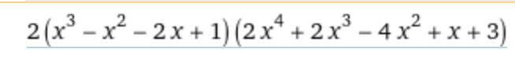

# Решалка домашки по алгебре Б72.
## Эта программа показывает какие варианты вам необходимо будет перебрать (с учетом оптимизации по делимости старшего коэффициента), чтобы получить искомый многочлен в результате интерполяции. Перебор идет только по целым старшим коэффициентам, дробные не учитываются (при хорошем раскладе).

###  Что необходимо для работы с программой:

1. Установить `g++`, ``clang++`` или любой (менее удобный) компилятор C++
	
 	Сделать это можно так (Ubuntu/Debian):
	```
	sudo apt install g++
	```
	или
	```
	sudo apt install clang++
	```
2. Прогнать свой многочлен через вольфрам и записать тот, который хотим получить (``deg = 3``).
3. Склонировать репозиторий к себе на устройство и перейти в его корень.


### Как взаимодействовать с кодом:
0. Все это выполняем, находясь в корне репозитория!
1. Чтобы запустить программу в терминале вводим:
	```
	make
	```
	если установили g++
	```
	make COMPILER=<yourCompilerName>
	```
	В результате чего сгенерируется исполняемый файл, который сразу будет запущен.
2. Дальнейшие инструкции вы увидите в терминале, в котором запустили программу. Пожалуйста, читайте выводимые инструкции внимательно и полностью, в противном случае ``поведение неопределено``. Важно, что программа выведет еще несколько(как пойдет) вариантов после найденного верного, а далее остановится, не перебирая все до конца.
3. Удалить исполняемый файл можно командой:
	```
	make clean
	```
 4. Повторно запускать программу той же командой


# Дисклеймер
## Автор не несет ответственности за полученные из программы результаты. Каждое решение следует проверить ручками, что явно лучше чем перебирать 1000 комбинаций. Программа не проверяет коэффициенты на целочисленность, следовательно могут быть ошибки. 
Также должен предупредить о такой ситуации:


Видим, что перед многочленом третьей степени стоит еще коэффициент.
Для начала запустите программу с такими коэффициентами, как стоят в решении. Потом внесите коэффициент в многочлен 3-ей степени и запустите программу с новыми коэффициентами. В обоих случаях проверьте решение ручками. Какой вариант требует перебора меньшего числа вариантов - оптимальный.

# Спасибо за внимание, ставьте звездочки)))

